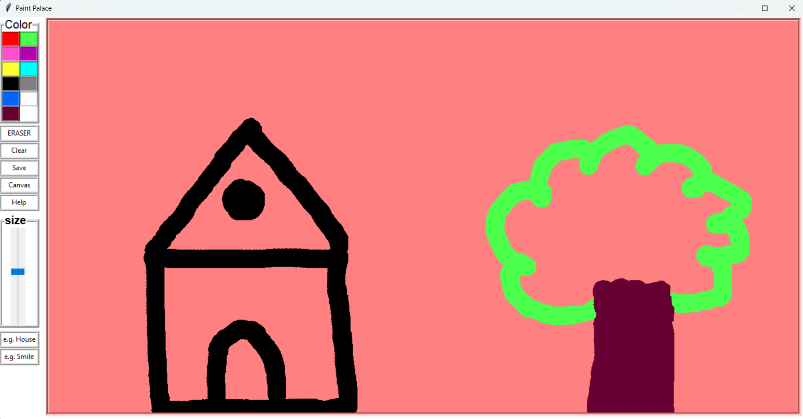

# Paint Palace

**Paint Palace** is a simple and intuitive painting/drawing application built using **Python Tkinter**. This application allows users to draw, sketch, and paint using different colors, brush sizes, and tools. Additionally, users can save their artwork as an image and even draw predefined shapes like a house or a smiley face.

## 🎨 Features

✅ **Draw with Different Colors** – Easily switch between multiple colors using the color palette.

✅ **Adjustable Pen Size** – Use the slider to increase or decrease the pen size.

✅ **Eraser Tool** – Easily erase any part of your drawing.

✅ **Canvas Background Color** – Change the canvas background color with a single click.

✅ **Save Your Drawing** – Save your artwork as a PNG image file.

✅ **Predefined Shapes** – Draw predefined shapes like a House or a Smiley Face using the provided buttons.

✅ **Clear Canvas** – Clear the entire canvas in one click.

✅ **Help Section** – Brief instructions to guide users through the app.

---



## 💻 Installation

Follow these steps to run the Paint Palace application on your local machine:

1. **Clone the repository**:

```bash
git clone https://github.com/rajanraj2/Paint_App.git
cd Paint_App
```

2. **Install dependencies (if not already installed)**:

```bash
pip install pillow
```

3. **Run the application**:

```bash
python main.py
```

---

## 📂 Project Structure

The project structure looks like this:

```
Paint-Palace
│
├── house.py          # Code to draw a house shape
├── smilingface.py    # Code to draw a smiley face
├── main.py   # Main application file
├── README.md         # Project documentation
```

---

## 💾 How to Use

1. **Select a color** from the color palette on the left.
2. Adjust the **pen size** using the slider.
3. **Draw** on the canvas using your mouse.
4. Use the **Eraser** to erase any part of your drawing.
5. Change the **Canvas background color** using the 'Canvas' button.
6. Click **Save** to save your drawing as a PNG image.
7. Use the **House** or **Smiley Face** button to draw predefined shapes.

---

## 📜 External Libraries Used

- **Tkinter** - For GUI development.
- **PIL (Pillow)** - For saving the canvas as an image.

---

## 💡 Future Improvements

Here are some improvements that can be made in the future:

- ✅ **Undo/Redo functionality.**
- ✅ **Shape tools like rectangle, circle, line, etc.**
- ✅ **Open existing image and draw on it.**
- ✅ **Layer functionality like Photoshop.**
- ✅ **Sketch-to-image conversion using AI (optional).**

If you would like to contribute to the project, feel free to fork the repository and submit a pull request.

---

## 🤝 Contributing

Contributions are always welcome! If you'd like to contribute:

1. Fork the repository.
2. Create a new branch (`git checkout -b feature-name`).
3. Commit your changes (`git commit -m 'Add some feature'`).
4. Push to the branch (`git push origin feature-name`).
5. Open a Pull Request.

---

## 💌 Contact

If you have any questions or suggestions, feel free to reach out:

- **GitHub**: [Your GitHub Profile](https://github.com/rajanraj2)
- **Email**: rajanraj253545@gmail.com

---

## ⭐ Show Your Support

If you like the project, please ⭐ star the repository to show your support! 😊
